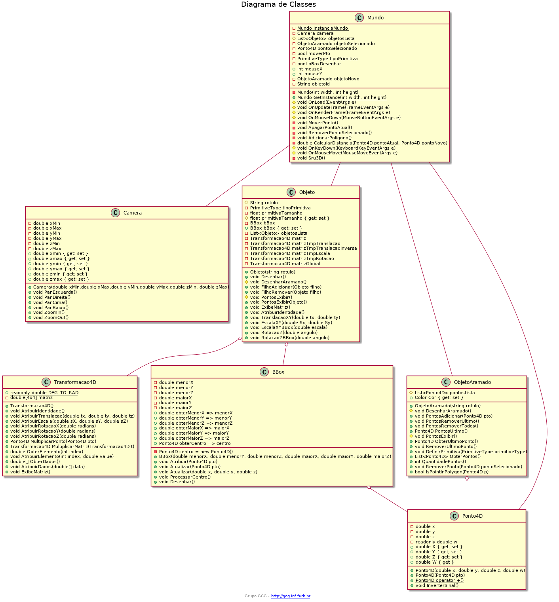

# Computação Gráfica - Trabalho 03

Alunos: 

- [Bruno Vigentas](https://github.com/bvigentas)
- [Francisco Lucas Sens](https://github.com/franciscosens)
- [Luciane Tedesco](https://github.com/lucianetedesco)

[Slides](assets/cg-slides_u3.pdf)

# Atalhos

| Questão                                       | Atalho                | Objetivo                                      | 
| --------------------------------------------- | --------------------- | -----------------                             |
|                                               | ESC                   | Sair                                          |
|                                               | C                     | Limpar Console                                |
|                                               | X                     | Apresentar Pontos                             |
| 04 - Estrutura de dados: polígono             | Botão Mouse Esquerdo  | Inserir ponto no polígono atual               |
| 04 - Estrutura de dados: polígono             | Espaço                | Inserir ponto no polígono atual               |
| 04 - Estrutura de dados: polígono             | D                     | Remove ponto do polígono atual                |
| 04 - Estrutura de dados: polígono             | T                     | Remove todos os pontos do polígono atual      |
| 04 - Estrutura de dados: polígono             | Enter                 | Finaliza o polígono atual                     |
| 05 - Estrutura de dados: vértices             | Botão Mouse Direito   | Seleciona o polígono com vértice mais próximo |
| 05 - Estrutura de dados: vértices             | U OU V verificar      | Apaga o vértice do polígono selecionado       |
| 06 - Visualização: rastro                     | Nenhum                |                                               |
| 07 - Interação: desenho                       | P                     | Desenhar polígonos abertos ou fechados        |
| 08 - Interação: cores                         | R                     | Definir Vermelho                              |
| 08 - Interação: cores                         | G                     | Definir Verde                                 |
| 08 - Interação: cores                         | B                     | Definir Azul                                  |
| 09 - Interação: BBox                          | O                     | Exibir BBox em Amarelo                        |
| 10 - Transformações Geométricas: translação   | Cima                  | Translação                                    |
| 10 - Transformações Geométricas: translação   | Baixo                 | Translação                                    |
| 10 - Transformações Geométricas: translação   | Direita               | Translação                                    |
| 10 - Transformações Geométricas: translação   | Esquerda              | Translação                                    |
| 11 - Transformações Geométricas: escala       | Home                  | Escala                                        |
| 11 - Transformações Geométricas: escala       | End                   | Escala                                        |
| 11 - Transformações Geométricas: escala       | Page Up               | Escala                                        |
| 11 - Transformações Geométricas: escala       | Page Down             | Escala                                        |
| 12 - Transformações Geométricas: rotação      | Número 1              | Rotação                                       |
| 12 - Transformações Geométricas: rotação      | Número 2              | Rotação                                       |
| 12 - Transformações Geométricas: rotação      | Número 3              | Rotação                                       |
| 12 - Transformações Geométricas: rotação      | Número 4              | Rotação                                       |
| 13 - Grafo de cena: selecionar                | F                     | Permitir adicionar filhos                     |
| 13 - Grafo de cena: selecionar                |                       |                                               |
| 13 - Grafo de cena: selecionar                |                       |                                               |
| 13 - Grafo de cena: selecionar                |                       |                                               |
| 13 - Grafo de cena: selecionar                |                       |                                               |

| 14 - Grafo de cena: transformação             |                       |                                               |

# Enunciado

## 1 - O que deve ser feito
O cenário consiste em implementar um Editor Vetorial 2D para "adicionar" e "manipular" polígonos abertos/fechados e convexos/côncavos utilizando somente o teclado e mouse.

Conhecimento necessário:
- estruturas simples dinâmicas para armazenar os dados gráficos;
- algoritmo de seleção: selecionar polígonos côncavos (não entrelaçados).
- transformações geométricas 2D: movimentar, girar e redimensionar objetos;
- conceitos básicos de grafo de cena.

Descrição: o cenário consiste em implementar um Editor Vetorial 2D para "adicionar" e "manipular" polígonos abertos/fechados e convexos/côncavos utilizando somente o teclado e mouse utilizando a biblioteca OpenGL/OpenTK. A aplicação deve permitir "adicionar" interativamente (“clicando” na tela) polígonos sem limite do número de vértices, e sem limite de polígonos. Além disso, cada polígono pode ter sua própria cor e deve ser possível: apagar/mover vértices e apagar/mover polígonos. Estas funções (apagar/mover) devem se interativas (o usuário deve clicar no polígono ou vértice).

Observação: as funções do OpenGL/OpenTK "glTranslate", "glRotate" e "glScale" não deve ser utilizada para fazer as Transformações Geométricas, e sim deve ser usado a classe "Transform" associada ao objeto gráfico. Assim o método de desenho do objeto gráfico utiliza "Transform" junto com as funções do OpenGL/OpenTK "glPushMatrix", "glMultMatrixd"e "glPopMatrix". A justificativa, é que desta forma isolasse o render do OpenGL/OpenTK facilitando, se for o caso, mudar para outra forma de renderizar (por exemplo, DirectX). Para evitar problemas com diferenças de valores entre coordenadas de tela e do espaço gráfico não altere os valores usados no Ortho do exemplo fornecido. Observem que após mover os objetos gráficos usando a matriz de transformação do referido objeto não é possível simplesmente selecionar o objeto usando os seus vértices originais. Tem de pegar o valor das coordenadas de tela (do pixel), converter para o espaço gráfico (do Ortho, se for o caso) e converter para o espaço do objeto gráfico transformado usando as matrizes de transformações do grafo de cena até chegar no objeto desejado.

## 2 - Especificação

Especifique as classes, métodos e atributos usando Diagrama de Classes.

## 3 - Documentação

[Documente o seu código com comentários em XML](https://docs.microsoft.com/pt-br/dotnet/csharp/codedoc).

## 4 - Estrutura de dados: polígono

Insera e remova polígonos da cena gráfica.

## 5 - Estrutura de dados: vértices

Ao clicar na tela utilizando o mouse selecione o vértice do polígono selecionado para pode mover ou remover o respectivo vértice.

Atenção: no caso do mover o vértice o valores da coordenada é alterada e não os valores da matriz de transformação.

## 6 - Visualização: rastro

Exiba o “rasto” ao desenhar os segmentos do polígono.

## 7 - Interação: desenho

Utilize o mouse para clicar na tela e desenhar polígonos (aberto ou fechado).

## 8 - Interação: cores

Utilize o teclado (teclas R=vermelho,G=verde,B=azul) para trocar as cores dos polígonos selecionado.

## 9 - Interação: BBox

Utilizando o mouse selecione um polígono (convexo ou côncavo) usando detecção hierárquica filtrando primeiro pela BBox e, se for interno a BBox então testar usando Scan Line (exibir a BBox do polígono selecionado usando a cor amarela).

## 10 - Transformações Geométricas: translação

Utilizando o mouse movimente o polígono selecionado.

Atenção: usar matriz de transformação e não alterar os valores dos vértices dos polígonos.

## 11 - Transformações Geométricas: escala

Utilizando o mouse redimensione o polígono selecionado em relação ao centro da sua BBox.

Atenção: usar matriz de transformação e não alterar os valores dos vértices dos polígonos.

## 12 - Transformações Geométricas: rotação

Utilizando o mouse gire o polígono selecionado em relação ao centro da sua BBox.

Atenção: usar matriz de transformação e não alterar os valores dos vértices dos polígonos.

## 13 - Grafo de cena: selecionar

Permita adicionar polígonos “filhos” num polígono selecionado utilizando a estrutura do grafo de cena.

Atenção: usar matriz de transformação global para acumular transformações de acordo com o grafo de cena.

## 14 - Grafo de cena: transformação

Considere a transformação global ao transformar (translação/escala/rotação) um polígono “pai”.

Atenção: usar matriz de transformação global para acumular transformações de acordo com o grafo de cena.

## Obs: 

- [x] Quando clicar com o botão esquerdo, criar um Ponto4D na tela
- [x] Quando clicar na tecla D, remover o ponto que está na variavel 'polignoAtual' que ficará localizada no Mundo.
- [x] O último ponto adicionado ficará armazenado no polignoAtual, caso o ponto é removido, adcionar null na variavel.
- [x] Ao clicar na barra de espaço, deverá parar o poligno.
- [x] Quando criar um ponto, criar outro igual.
- Quando o usuário mecher o mouse, mover o segundo ponto.
- Clicar na tecla P, altera a primitva Line_loop para line_tr
- 4 clica na tela com mouse esquerdo -> inserir vertice (Ponto4D)
    - [x] Finalizar - espaço
    - [x]remover tecla D -> polignoAtual (propriedade), quando remover fica nulo
- 5 clica na tela com mouse direito -> seleciona o vertice mais próximo e move
	- clica na tecla v -> remover
- 6 fazer o rastro -> sempre inserir dois ptos na matriz
- 7 sempre inicia o poligno com primitiva line_loop
	- clicar P tecla ai troca para line_strap
- 8 troca a cor do poligno selecionado

# Diagrama de Classes

Deve-se ter um polígono,  apertar F e daí começa a desenha outro polígono sendo filho do polígono selecionado, ao apertar enter para o filho e tira a seleção do pai

Ao selecionar um deve-se selecionar a BBox
